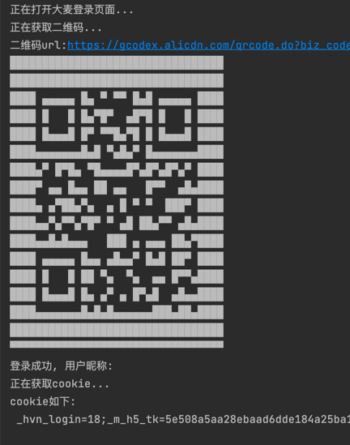

# dm-login
大麦登录

## 简介

基于无头浏览器的扫码登录, 支持终端扫码。

### 原理:

1. 操作无头浏览器, 获取页面的二维码图片。
2. 将图片解析出二维码内容。 
3. 将二维码内容输出到终端。
4. 监听页面状态, 等待扫码完成。
5. 获取浏览器cookie。

### 对比接口方式实现:

##### 优点

- 实现更为简单。
- 维护成本低。
- cookie比较完整。

#### 缺点
- 速度慢一点。
- 比较费资源。

## 使用

- python版本: `3.7+`

- pyzbar模块依赖zbar, 需要先安装zbar:

  - mac:   `brew install zbar`
  - linux: `sudo apt-get install libzbar0`

- 安装依赖: `pip install -r requirements.txt`

- 执行程序: `python login.py`, 首次执行会自动下载`chromium`。

## 注意

- **此demo仅验证一下思路是否可行, 细节需自行完善, issue一律不处理。**
- python操作浏览器的异步库比较推荐使用: [playwright](https://playwright.dev/python/)。
- nodejs可使用: [puppeteer](https://pptr.dev/)。

## 特别声明

- 本项目内所有资源文件，禁止任何公众号、自媒体进行任何形式的转载、发布。
- 编写本项目主要目的为学习和研究Rust，无法保证项目内容的合法性、准确性、完整性和有效性。
- 本项目涉及的数据由使用的个人或组织自行填写，本项目不对数据内容负责，包括但不限于数据的真实性、准确性、合法性。使用本项目所造成的一切后果，与本项目的所有贡献者无关，由使用的个人或组织完全承担。
- 本项目中涉及的第三方硬件、软件等，与本项目没有任何直接或间接的关系。本项目仅对部署和使用过程进行客观描述，不代表支持使用任何第三方硬件、软件。使用任何第三方硬件、软件，所造成的一切后果由使用的个人或组织承担，与本项目无关。
- 本项目中所有内容只供学习和研究使用，不得将本项目中任何内容用于违反国家/地区/组织等的法律法规或相关规定的其他用途。
- 所有基于本项目源代码，进行的任何修改，为其他个人或组织的自发行为，与本项目没有任何直接或间接的关系，所造成的一切后果亦与本项目无关。
- 所有直接或间接使用本项目的个人和组织，应24小时内完成学习和研究，并及时删除本项目中的所有内容。如对本项目的功能有需求，应自行开发相关功能。
- 本项目保留随时对免责声明进行补充或更改的权利，直接或间接使用本项目内容的个人或组织，视为接受本项目的特别声明。